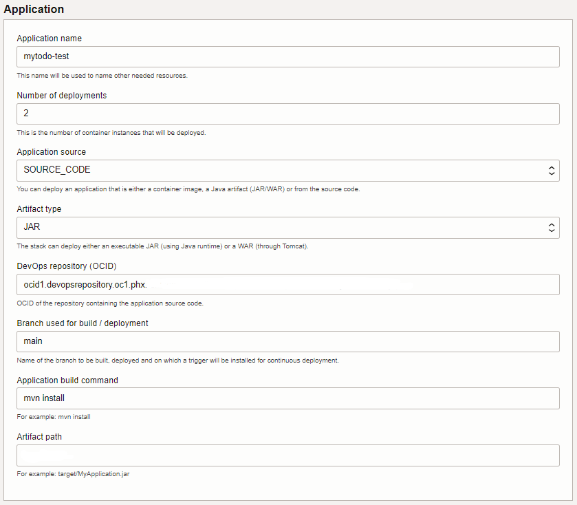

# Usage Instructions

The **Stack Configuration** has 10 sections listed below. Once it is configured it can be *deployed* on the Oracle Cloud Infrastructure to provision the resources and deploy your application.

## General Configuration

Choose the **compute compartment** and **availability domain** where will all resources in the stack be created.

## Your Application

This section describes the packaging and deployment of your application.

The stack supports different kinds of deployments: *source code* deployment, java *artifact* deployment or *container image* deployment. Each type of deployment has different prerequisites and requires different parameters. *Source code* deployment is possible if the *source code* of the application is stored in OCI DevOps (mirrored repositories from other sources like GitHub to OCI DevOps); Java *artifact* deployment requires a Java *artifact* to be present if the OCI *artifact* Registry; and *container image* deployment requires the *container image* to the present in an OCI Container Registry accessible by the Stack, the image must be configured to respond to HTTPS requests through the exposed port.

- **Application Name:** application identifier, this name will be used as a prefix to some of the resources created by the stack (special characters should be avoided)
- **Number of deployments:** this is the number of container instances that will be deployed, each container instance will run the application behind a firewall
- **Application source:** source code, *artifact*, or container registry 
  - If the *application source* is either *source code* or artifact:
    - **Artifact type:**
       - JAR: If your application is packaged as an executable Java Archive. The java archive will be run with the *JVM options* and *Program arguments* provided in the "Other parameters" section.
       - WAR: If your application is packaged as a Web Archive. The WAR will be deployed in a Tomcat Server. This Tomcat Server will be started using the JVM Options provided in the "Other Parameters" section.

  - If the *application source* is *source code*: 
       - **DevOps repository (OCID):** OCID of the repository containing the *source code* of the application
       - **Branch used for build/deployment:** name of the branch to build a deploy. A build trigger will be added so that the application is built and deployed each time a change is made to this branch.
       - **Application build command:** command used to build the application. This command will be used by the build pipeline to build the application.
       - **Artifact path:** The path to the generated application *artifact* (jar or war file) after the build command has run.
  - If the *application source* is an *artifact*:
       - **DevOps compartment:** select the compartment where the DevOps project will be created
       - **Artifact repository OCID:** OCID of the repository containing the artifact
       - **Artifact OCID:** OCID of the *artifact* to deploy
  - If the *application source* is a *container image*:
       - **DevOps compartment:** select the compartment where the DevOps project will be created
       - **Full path to the image in the container registry**
       - **Exposed port:** port exposed by the container image

## Stack authentication

An **authentication token** is used by the stack to authenticate the user when connecting to the code repository or container registry. This token can either be provided or created by the stack. **Note** that there is a limit on the maximum number of authentication tokens a user can have and that once the token is generated it will not be displayed again.

To use an existing token:
  - **User's authentication token:** provide the user's authentication token

A **Vault** is used to store sensitive information such as authentication tokens and passwords. The stack can either use an existing vault (which can be in a different compartment) or create a new one.

To use an existing key vault :

 - **Compartment:** select the compartment containing the vault
 - **Vault:** select the vault you would like to use
 - **Encryption key:** select a AES encryption key to use

To create a new vault:

 - **Key vault display name:** user-friendly name of the vault to create. The vault will be created in the same compartment as the rest of the resources created by the stack.

## Application Performance Monitoring (APM)

Your application will automatically be monitored through APM using the Java Agent.

## Database

The stack assumes that the persistence is handled by a database and this section lets you configure that database. You can either choose an existing database or create a new one. If you create a new one it will be configured by the stack so that the application can connect to it using network security groups and a private endpoint. If you choose an existing database, you need to configure the network access for the application. For example, if an Autonomous Database Serverless is chosen, access from the application may require either a private endpoint or an ACL rule. 

 - Use existing database:
   - **Autonomous Database compartment:** compartment containing the autonomous database
   - **Autonomous Database:** this drop-down field lists all autonomous databases in the selected compartment. Select the database you want the application to access.
   - **DB Username:** provide the username that the application should use to access the database
   - **DB user password:** provide the user's password
 - Create a new database:
   - **Autonomous Database display name:** the user-friendly display name of the autonomous database
   - **Database ADMIN password:** password of the ADMIN user of the database
   - **Storage (TB):** The amount of storage in TB to allocate.
   - **OCPU count:** The number of OCPU cores to enable. Available cores are subject to your tenancy's service limits.

If the application consumes environment variables to configure the database access, the stack can set these environment variables so that the application will connect to the selected database. If the *application source* is either *source code* or *artifact*, the stack will configure the application to use mutual TLS when connecting to the database. In order to do so, the stack will download the wallet of the selected database, it will then store the username and password used to access the database in it (Secure External Password Store wallet). This wallet can then be provided to the application using the TNS_ADMIN environment variable. In the *application source* is a *container image*, the image must contain the SEPS wallet required to estblish the connection to the DB.

If you are deploying the application from either *source code* or *artifact*, the stack will always add the wallet that includes the database credentials to the image it generates and set the TNS_ADMIN environment variable to point to it. Therefore the only configuration parameter needed to connect to the database is the connection URL that can be set through an environment variable whose name is configurable. A check box will allow you to choose if you want to use an environment variable to set the connection URL and if you check that checkbox you will be prompted for the environment variable's name.

 - **Set connection URL environment variable:** check this checkbox if your application can consume an environment variable to configure the URL.
   - **Connection URL environment variable name:** name of the environment variable the stack will set the database connection URL to.

If you are deploying the application using a *container image*, three environment variables will be available to you, use the checkboxes to enable the use of environment variables and the text fields to provide the environment variable names.

 - **Set connection URL environment variable:** check this checkbox if your application can consume an environment variable to configure the URL.
   - **Connection URL environment variable name:** name of the environment variable the stack will set the database connection URL to.
 - **Set username environment variable:** check this checkbox if your application can consume an environment variable to configure the database username (available only if the *application source* is image).
   - **Database user environment variable name:** name of the environment variable the stack will set the database username to.
 - **Set password environment variable:** check this checkbox if your application can consume an environment variable to configure the database username (available only if the *application source* is an image).
   - **Database user's password environment variable name:** name of the environment variable the stack will set the database user's password to.

## Other Parameters

Besides the above-predefined environment variables, the stack allows you to provide other parameters to your application. This can be achieved by providing environment variables, JVM options, and/or program arguments. The use of the JVM option is possible when the *application source* is either *source code* or *artifact*, and the use of program arguments is only possible when the *artifact* type is JAR.

 - **Other environment variables:** If your application consumes environment variables, you can use this field to set these environment variables. Environment variables should be provided as a semicolon-separated list of <name, value> pairs in the following format: var1=value1;var2=value2 ... varN=valueN. These environment variables will then be set on the container instances.
 - **JVM options:** You can also provide JVM options that will be set when starting the Java VM. If the *artifact* type of your application is a JAR, the JVM Options will be set when starting the JAR file and if the *artifact* type is a WAR, the JVM Options will be set when starting Tomcat. All types of JVM options are allowed.
   - Standard options for example a system property: -DmySystemProperty=myValue
   - Non-Standard options for example setting how much memory will be allocated for your JVM: -Xms1g -Xmx8g
 - **Program arguments:** If your application consumes arguments, you can use this field to set them. Arguments should be provided as a space-separated list and will be passed to the application at start-up : arg1  arg2 ..., argN.

## SSL configuration between Load Balancer and backend

A certificate is needed to configure the load balancer and the backends so that the communication between them is done using SSL. If the *application source* is either *source code* or *artifact*, the stack will create this certificate, if the *application source* is a *container image* it is required for the *container image* to be configured using a certificate and that this certificate is provided so that the stack can configure the load balancer accordingly.

If the *application source* is either *source code* or *artifact*, the stack creates the self-signed certificate that will be used for the communication between the load balancer and the backends. This self-signed certificate is stored in a JKS keystore. If the *artifact* type is a WAR (web application deployed using Tomcat) Tomcat will be configured to use this keystore. If the *artifact* type is JAR the stack can use properties to configure SSL for the application. By default, Spring boot properties will be used by the stack. A checkbox allows to change that configuration.

 - **Server port number property name:** Assuming that your application can consume a property to configure the server port, this field can be used to specify the name of the property.
 - **SSL keystore filename property name:** Assuming that your application can consume a property to configure the SSL keystore filename, this field can be used to specify the name of the property.
 - **SSL key alias property name:** Assuming that your application can consume a property to configure the SSL key alias property name, this field can be used to specify the name of the property.
 - **SSL keystore password property name:** Assuming that your application can consume a property to configure the SSL keystore password property name, this field can be used to specify the name of the property.
 - **SSL keystore type property name:** Assuming that your application can consume a property to configure the SSL keystore type property name, this field can be used to specify the name of the property.

If the *application source* is a *container image*, the image must be configured to use SSL, the following information is necessary to configure the load balancer:

 - **SSL certificate:** The public certificate (PEM format)
 - **Private key:** The certificate's private key (PEM format)
 - **CA certificate:** The CA certificate (PEM format, same as the certificate for self-signed certificates)

## Application URL

This is optional but if you have a DNS domain that's managed in OCI you can configure the stack to add a new record (hostname) for your application. A certificate will also be needed so that the application can be accessed through HTTPS.

 - **DNS and Certificate compartement:** select the compartment containing the DNS Zone and the Certificate
 - **DNS zone:** Domain name in which the hostname will be created.
 - **Hostname:** The hostname will be created on the selected Zone and will resolve to the load balancer's IP address.
 - **Certificate OCID:** certificate for the application URL

## Network

The stack is designed to create all of its resources in the same VCN. It uses three subnets:
1. The application subnet which contains the container instances running the application and the container instances running the deployment pipelines;
2. The database subnet which contains the database if it is created by the stack and
3. The load balancer subnet which contains the load balancer.

The application and database subnets are private subnets, the load balancer subnet can be either a private or a public subnet depending on whether the load balancer should be accessible from the internet or not. 

You can either create a new VCN by providing its CIDR blocks:

 - **VCN IPv4 CIDR Blocks:** IP address range of the Virtual Cloud Network

Or use an existing VCN by choosing the compartment containing the VCN and selecting the VCN from the drop-down list:

 - **The compartment of the existing VCN:** select the compartment of the existing VCN you want to use
 - **Select to VCN:** select the existing VCN to be used

The application subnet will contain the container instances running the application and will also be used by the deployment pipeline. A Network Security Group will be created with ingress rules that allow the load balancer to access the application on its exposed port and egress rules that allow the application to connect to the database and other OCI Services through a Service Gateway.  If you use an existing VCN, you have the choice between using an existing subnet for the application subnet or creating a new one. If you chose to use and existing application subnet you should make sure that the subnet configuration does not prevent the application from accessing the database and other OCI Services and also does not prevent the load balancer form accessing the application on the exposed port.

 - Create a new application subnet
   - **Application Subnet IPv4 CIDR Blocks:** IP address range of the Application subnet. This range should be a subset of the VCN subnet and should not overlap with the other subnets in the VCN. Container instances running the application and deploy pipeline will use this subnet.
 - Use existing application subnet
   - **Select the application subnet:** Container instances running the application and deploy pipeline will use this subnet. This list will only contain private subnets.

A database subnet is only needed if the Stack creates a new database, as only the database will be created in this subnet. A Network Security Group will be created with ingress rules that allow the application to connect to the database. If you use an existing VCN, you have the choice between using an existing subnet for the database or creating a new one. If you chose to use an existing database subnet you should make sure that the subnet configuration does not prevent the application from accessing the database.

 - Create a new database subnet
   - **Database Subnet Creation:** IPv4 CIDR Blocks: IP address range of the Database subnet. This range should be a subset of the VCN subnet and should not overlap with the other subnets in the VCN. The Autonomous Database will be created using this subnet.
 - Use existing database subnet
   - **Select the database subnet:** The Autonomous Database will be created using this subnet. This list will only contain private subnets.

The load balancer subnet can either be a private or a public subnet. Resources in a private subnet can only have private IP addresses and are only accessible from inside OCI; while resources in a public subnet can have both private and public IP addresses and are accessible from both OCI and the Internet. A Network Security Group will be created with an ingress rule that allows access to the load balancer, and an egress rule that allows the load balancer to access the application. If you choose to open the load balancer to the Internet, the load balancer subnet will be a public subnet, and an Internet Gateway will be created. If you are using an existing VCN you can choose to use an existing load balancer subnet or create a new one. The choice of existing load balancer subnet (private or public) should be consistent with whether you want to open access to the load balancer from the Internet or not.

 - Create a new load balancer subnet
   - **Load Balancer Subnet IPv4 CIDR Blocks:** IP address range of the Load Balancer subnet. This range should be a subset of the VCN subnet and should not overlap with the other subnets in the VCN. The Load Balancer will use this subnet.
 - Use existing load balancer subnet
   - **Select the load balancer subnet:** The Load Balancer will be created using this subnet. This list will contain both public and private subnets. Note that if a private subnet is chosen, the Load Balancer will not have a public IP address and will therefore not be directly accessible from the Internet.
 - **Open load balancer's HTTPS port:** By checking this checkbox you agree to make the load balancer subnet public and to open the HTTPS port of the load balancer to the Internet.

By default the load balancer is configured with a minimum and maximum bandwidth of 10Mbps, the health check URL is set to "/" and the status code 200. These values can be changed if needed.

 - **Maximum bandwidth (Mbps):** 10Mbps for always free load balancer
 - **Minimum bandwidth (Mbps):** 10Mbps for always free load balancer
 - **URL path (URI):** This url will be used by the health checker to verify that the application is running
 - **Status code:** Status code returned by the health checker URL when the application is running

## Container instance configuration

Finally you can choose the shape and size of the container instances that will run your application.

 - **Container instance shape:** A shape is a template that determines the number of OCPUs, amount of memory, and other resources that are allocated to a container instance.
 - **Memory (GB):** Memory configuration for the container instance
 - **OCPU:** Number of OCPU for the container instance.
