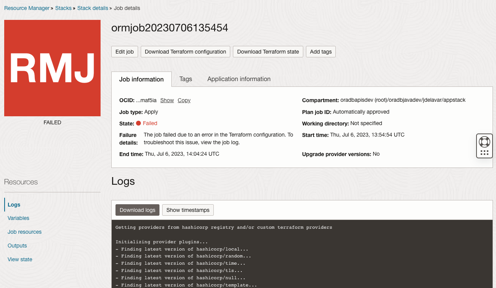
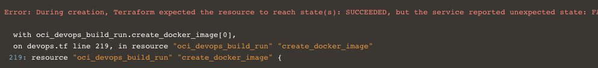
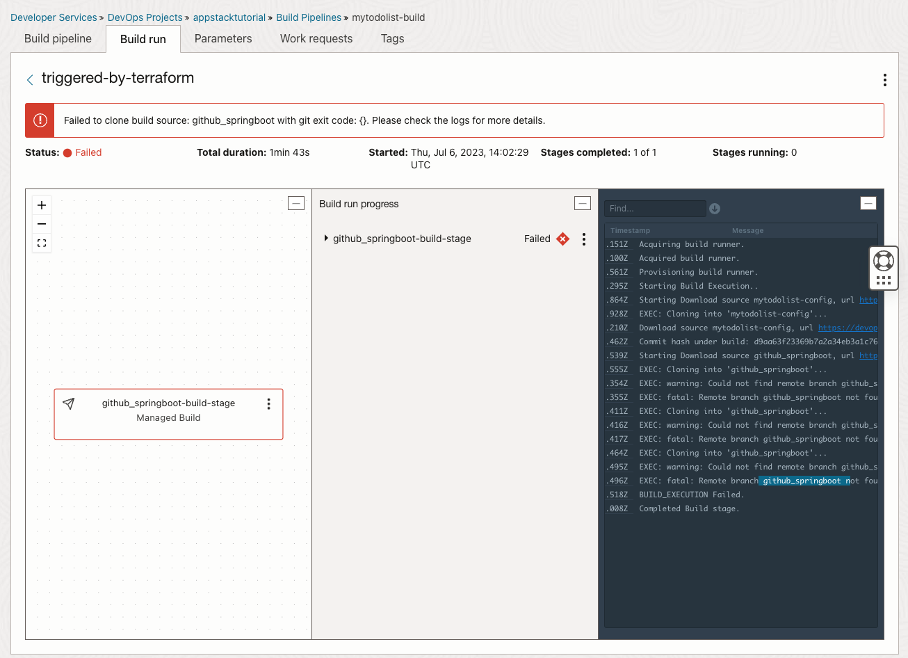
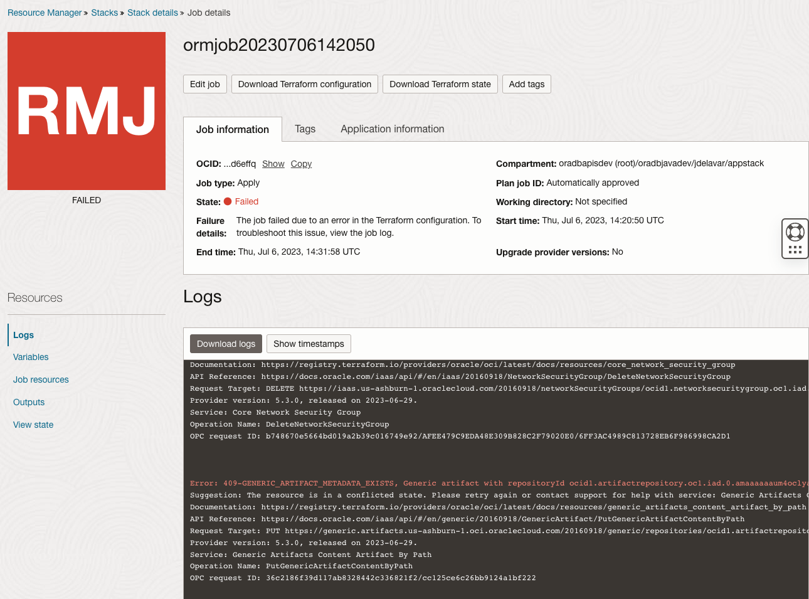
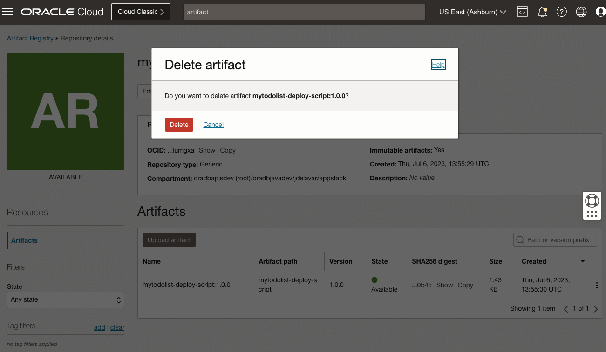

# Troubleshooting

This document lists the common errors seen when using the stack.

## Stack error: pipeline build error

The failure details says: "The job failed due to an error in the Terraform configuration. To troubleshoot this issue, view the job log."



If this error shows up at the end of the stack execution

```
Error: During creation, Terraform expected the resource to reach state(s): SUCCEEDED, but the service reported unexpected state: FAILED.
  with oci_devops_build_run.create_docker_image[0],
  on devops.tf line 219, in resource "oci_devops_build_run" "create_docker_image" 
 219: resource "oci_devops_build_run" "create_docker_image" {
```



This indicates that the build pipeline failed. Go to the build pipeline log to see the error. In this case the git project branch was not found:



## Stack error: artifact already exists

The failure details says: "The job failed due to an error in the Terraform configuration. To troubleshoot this issue, view the job log."



```
Error: 409-GENERIC_ARTIFACT_METADATA_EXISTS, Generic artifact with repositoryId ocid1.artifactrepository..., artifactPath mytodolist-deploy-script and artifactVersion 1.0.0 exists. Existing genericArtifactId: ocid1.genericartifact.oc1.iad...
Suggestion: The resource is in a conflicted state. Please retry again or contact support for help with service: Generic Artifacts Content Artifact By Path...
```

This is a pretty common error. The stack is not able to delete the previous artifact. To fix this, go to the "artifact registry" and manually delete the artifact:



## Destroying the stack fails

Before destroying the stack you must manually delete the artifact.

You may also need to manually deletet the VCN that the stack created.
