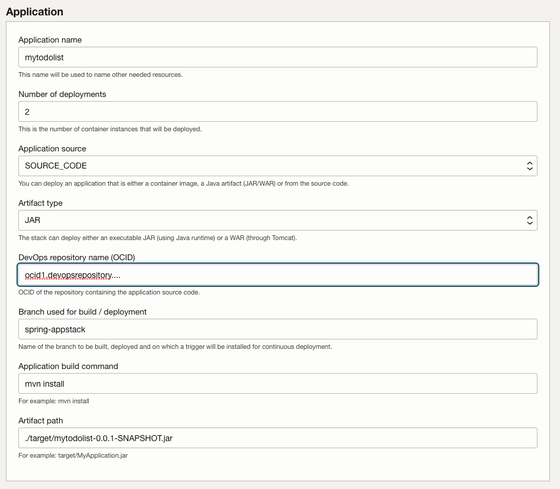

# App Stack for Java tutorial

In this tutorial we'll deploy a sample SpringBoot application using the stack.

## 1. Prepare the code repository

In GitHub, fork the following repo: [oci-react-samples](https://github.com/oracle/oci-react-samples/tree/spring-appstack). Note that we will only used the branch "spring-appstack" for this tutorial.


If you don't already have Personal Token, create one and note it down. We'll use it in the next step.


## 2. Create the compartment, vault and dynamic group in OCI

### Compartment

Create a compartment called "appstack". All the resources created by the stack will be created under this compartment. Note the compartment's OCID as it will be used later.


### Create a vault

Create a vault called "appstack":


Add a key called "appstack":


 ... and add the GitHub token as a secret.


### Create the dynamic group

This dynamic group called "appstack" will match the DevOps resources needed to execute the build pipeline. This is where the compartment's OCID is needed:

```
All {resource.compartment.id = 'ocid1.compartment.oc1..............', Any {resource.type = 'devopsdeploypipeline', resource.type = 'devopsbuildpipeline', resource.type = 'devopsrepository', resource.type = 'devopsconnection', resource.type = 'devopstrigger'}}
```

ocid1.compartment.oc1..aaaaaaaajdsrhcul44hm25l3covur5hjs3sfcaek26inmjkntriwm2ee23ua


### Create the policy for this dynamic group

Create a new policy under the "appstack" compartment called "appstack"
```
Allow dynamic-group appstack to read secret-family in compartment appstack
Allow dynamic-group appstack to read devops-family in compartment appstack
```


## Create project in DevOps

### Create a new project 

Create a new DevOps project called "appstacktutorial". This involves creating a topic "appstacktutorial".


Be sure to turn on logging:


### Setup the connection to GitHub


### Mirror the repo


Your repo should now be created. Note its OCID as it will be used later.


## Configure the stack

Go to the  and click on the "Deploy" button:





